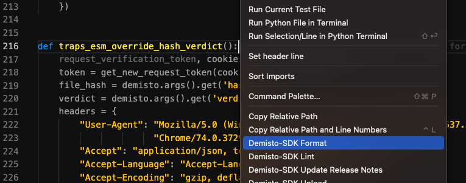
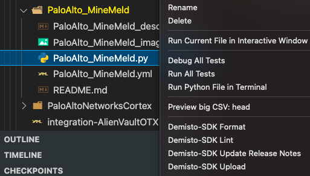

# Change Log

## [Unreleased]

- The **xsoar.autoFindProblems.readProblems** setting defaults to ***false*** which prevents the log file from appearing in each workspace opened.
- The **xsoar.demisto-sdk.pythonPath** is now deprecated.  
    Please use the **xsoar.demisto-sdk.Path** setting. The default behavior is to run all commands with `demisto-sdk <command>`. You may set the demisto-sdk executable with the given setting and use tools such as pipx.  
    Alternatively, you may also use it with your python executable of choice (`<python-path> -m demisto_sdk` as an example.)
- Added the **Run a Command in XSOAR** command.
- Removed the support of the **maintenance** option from the *Update Release Notes* command.
- Fixed running commands in menus from directories.
- Added an option to run lint with tests in menu.

## [0.1.0] (2021-11-09)

- The Cortex XSOAR extension for Visual Studio Code is now official GA!

## [0.0.7] (2021-10-05)

- **Hotfix**: Fixed an issue which caused the extension to fail on all commands (on version 0.0.6).

## [0.0.6] (2021-09-29)

- **Hotfix**: Fixed an issue which caused the extension to fail.

## [0.0.5] (2021-09-29)

- Fixed an issue where the right-click menu was not available on Windows systems.

## [0.0.4] (2021-07-20)

- Added the `xsoar.autoFindProblems.readProblems` setting that can enable/disable automatic-problem reading in workspace.
- Added the command `XSOAR: Read Problems` that reads the demisto-sdk report file positioned in the `xsoar.autoFindProblems.reportPath` setting.
- Added the demisto-sdk commands dropdown when right-clicking an opened file in `Packs/*` directory.
- Limited the demisto-sdk commands dropdown when right-clicking a file in workspace to work only with file in `Packs/*` directory.  

## [0.0.3] (2021-07-13)

- Added a side menu to easily run demisto-sdk command from the explorer  

- renamed all demisto-sdk command names to include Demisto-SDK as the prefix (XSOAR: Lint -> XSOAR: Demisto-SDK Lint)

## [0.0.2] (2021-07-12)

- Added a new output window, "Cortex XSOAR" for extension logs and other outputs.
- Added the `xsoar.demisto-sdk.pythonPath` setting to point to where the python environment with [demisto-sdk](https://github.com/demisto/demisto-sdk) is located.
- Added basic light-theme.

## [0.0.1] (2021-07-11)

- Initial release
