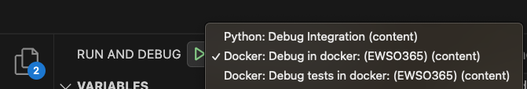
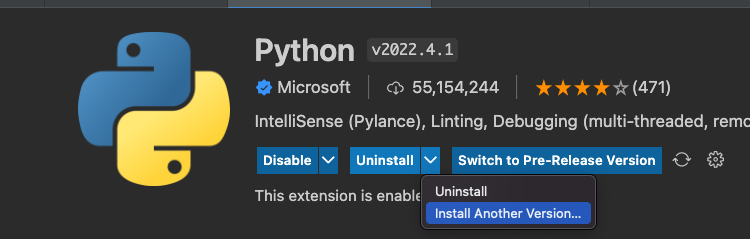
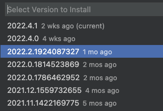

# Cortex  XSOAR VSCode Plugin

Work with Visual Studio Code to edit, validate and format your Cortex XSOAR integrations and automations.

To start using the extension, first of all, install [demisto-sdk](https://pypi.org/project/demisto-sdk/).  

You can also use the *XSOAR: Install/Update Demisto-SDK* command.  

Commands:

* *XSOAR: Setup integration/script environment*: Setups the environment of integration or a script.
* *XSOAR: Demisto-SDK Validate/Lint*: Run linters and validators on opened file directory.
* *XSOAR: Demisto-SDK Update Release Notes*: Update release notes of the opened file's pack.
* You can also run the commands directry from the explorer menu:  

NOTE: You have to run the commands from a content-like repository, i.e. */content/packs/* .

## Configurations  

### Local Environment (LINUX or MacOS)

Execute the command *XSOAR: Install XSOAR local development environment*.
This will install local development environment with **demisto-sdk** and will configure the **demisto-sdk** with XSOAR.
If **Homebrew** is available, you can choose to install any of **python**, **poetry**, **node**, **docker** or **pyenv**.

### Remote Environment (All OS)
Or you can follow [this guide](https://xsoar.pan.dev/docs/tutorials/tut-setup-dev-remote) to configure a fully configured remote development environnement, with `demisto-sdk` and more features preinstalled.

## Configure XSOAR connection

This will configure `.env` file with the following environment variables:
* DEMISTO_BASE_URL (XSOAR URL)
* DEMISTO_USERNAME (XSOAR username)
* DEMISTO_PASSWORD (XSOAR password)
* DEMISTO_API_KEY (XSOAR API key)
* XSIAM_AUTH_ID (XSOAR/XSIAM Auth ID) (Relevant for XSOAR 8/XSIAM)
* DEMISTO_VERIFY_SSL (Verify SSL in XSOAR, `true` or `false`) 
## Configure XSOAR unit tests

The extension supports configuring the integration/script unit tests.

When working on an integration or a script, you can right click on it, and click on **Configure XSOAR unit tests**. This will configure the XSOAR unit-tests to run and debug them in the **_test.py** to run from the test file or from the `Test Explorer`:

If you there is a **Pytest discovery error**, there is a probably missing dependencies. Either install the missing dependencies, or use [Setup integration/script environment](#Setup-integration/script-environment) with new workspace instead.

## Setup integration/script environment

The extension supports configuring integration/script environment.

When working on an integration or a script, you can right click on it, and click on **Setup integration/script environment**.

This will configure debugging and testing the integration/script in a Docker container.

To execute the integration/script in the container, you can use the `Run` button in the top right corner of the editor, and select `Debug in docker` option.
To execute the integration/script tests in the container, you can use the `Run` button in the top right corner of the editor, and select `Debug tests in docker` option.

You will be prompted to choose between current workspace or a new workspace. Opening a new workspace will create a new virtual environment with the integration/script dependencies installed, and will open a new VSCode workspace with the integration/script folder. This will allow better IDE autocompletion, but the creation of virtual environment may take a few minutes.

This is the recommended way to develop and debug your integration.

## Python 2.* Support

Using a Python 2.* virtual environnement or container, *mypy* will not be able to be installed.

For debugging the tests, it is necessary to install The VSCode Python extension version `2022.2`:

## Contributing

Contributions are welcome and appreciated. To contribute follow the instructions below and submit a PR.

Before merging any PRs, we need all contributors to sign a contributor license agreement. By signing a contributor license agreement, we ensure that the community is free to use your contributions.

When you open a new pull request, a bot will evaluate whether you have signed the CLA. If required, the bot will comment on the pull request, including a link to accept the agreement. The CLA document is also available for review as a [PDF](https://github.com/demisto/content/blob/master/docs/cla.pdf).

If the `license/cla` status check remains on *Pending*, even though all contributors have accepted the CLA, you can recheck the CLA status by visiting the following link (replace **[PRID]** with the ID of your PR): <https://cla-assistant.io/check/demisto/vscode-extension?pullRequest=[PRID]> .

## Development

### Dev Setup Environment  

* `npm install`
* `npm run compile`
* `pip install demisto-sdk`

### Main Locations

* _package.json_: Define commands

* _src/extension.ts_: The entry point of the extension

* _src/tests/_: Location of the mocha-suite test files.

* _css/panel.css_: The CSS file of script/automation webview
